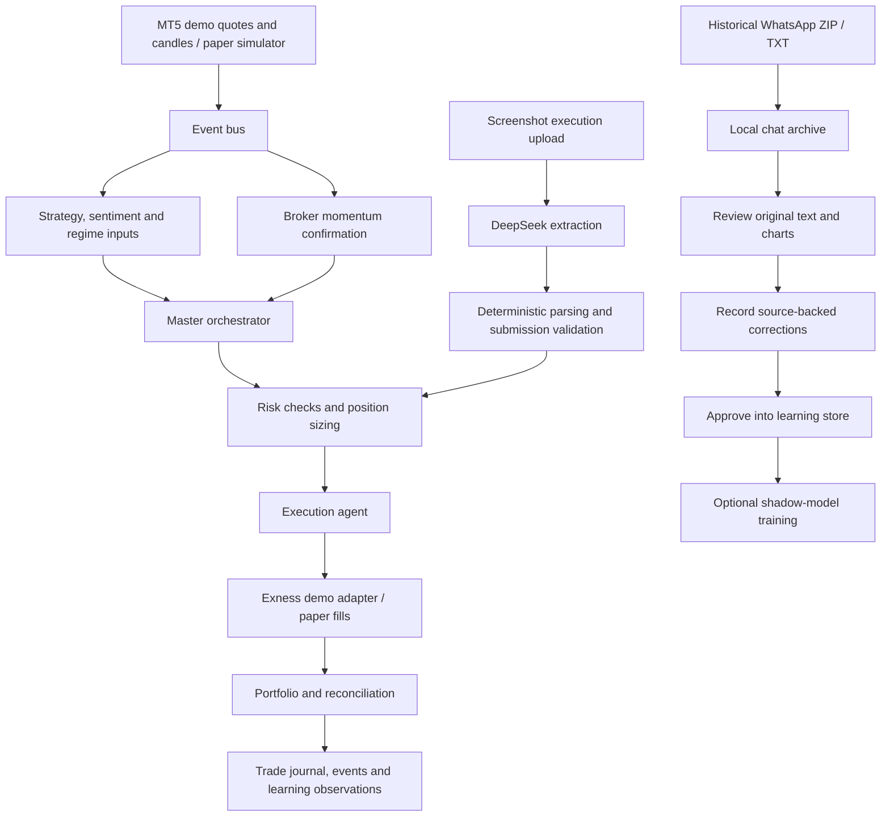

# NexusAI Trading Simulator: Project Report

**Report date:** 7 September 2026  
**Runtime snapshot:** approximately 23:23-23:25, Asia/Karachi (UTC+05:00)  
**Workspace reviewed:** `D:/project`  
**Scope:** current architecture, capabilities, verification evidence, limitations and engineering priorities.

## 1. Executive Assessment

NexusAI is a working local demo-trading application with an event-driven agent backend, an Exness MT5 demo adapter, a monitoring dashboard, screenshot signal submission and a historical chat-review workspace.

It is suitable for supervised development and controlled demo experiments. It is not yet a validated autonomous trading system or a demonstrated profitable imitation model.

The strongest completed work is the separation between historical imports and execution, explicit risk checks, local audit storage, and a usable review workflow. The main gaps are reliable signal freshness, reproducible trading research, meaningful ML targets and validation, durable trade attribution, and deployment security.

The system currently reports **13 agents running**, but a running agent is not evidence that its output is accurate, based on real external data, or contributing to profitable decisions. Similarly, the readiness endpoint's GREEN status checks configuration and connection prerequisites; it does not certify the entire system.

No trades, model training, shock injections or kill-switch operations were initiated to prepare this report. Application code was inspected but not changed during report preparation.

## 2. Verified Current State

| Area | Observed state | What this establishes |
|---|---|---|
| Backend | `/api/health` returned `healthy` | API was responding at inspection time |
| Agent runtime | 13 agents returned `running` | Agent instances were active |
| Event bus | 1,226 events processed, zero reported errors, queue size zero at the snapshot | No bus errors reported in that runtime window |
| Exness adapter | Connected; demo execution enabled | Demo connection and configuration checks passed |
| Trading symbols | EURUSDm, USOILm, XAUUSDm | Current executable symbol configuration |
| Watched symbols | XAUUSDm, EURUSDm, BTCUSDm, USOILm | Watchlist is broader than the execution allowlist |
| Broker order limits | Maximum volume 0.01; configured maximum order risk USD 2 | Configured controls, not a guarantee of realized loss under every execution condition |
| Private readiness | GREEN | Configured services and demo prerequisites passed |
| Synthetic price pipeline | Not running; tick count zero | Consistent with the MT5 demo market-data path being selected |
| Imitation model | Untrained; execution disabled; shadow-only | No trained local model artifact available |
| Learning dataset | Two examples: one PARSED, one IMPORTED; zero closed examples | Insufficient evidence for training or performance evaluation |
| Chat archive | 784 messages, 83 images | User-provided export was stored locally |

These are point-in-time observations, not an uptime or profitability certification. Broker P&L and trade-by-trade reconciliation were not independently audited for this report.

## 3. Architecture

### Application Layers

| Layer | Implementation | Responsibility |
|---|---|---|
| Frontend | React 18, Vite, Tailwind and page-specific CSS | Monitoring, controls, uploads and historical review |
| API | Python, FastAPI, REST and WebSocket endpoints | Application lifecycle, dashboard data and commands |
| Coordination | Async event bus and master orchestrator | Signal aggregation, decision dispatch and event distribution |
| Trade controls | Risk and execution agents | Validation, sizing, vetoes and order execution |
| Broker adapter | Local MetaTrader5 integration | Quotes, candles, demo orders, positions and position-level changes |
| Persistence | SQLite databases and local image files | Trades, events, journals, provider examples and chat archives |
| Screenshot extraction | Configurable DeepSeek HTTP client | Convert an uploaded image into structured signal fields |
| Historical import | Deterministic transcript and signal processing | Preserve chat history, identify candidates and support review |
| ML | NumPy logistic regression | Experimental classifier trained on signal acceptance labels |

### Three Distinct Workflows

**Important distinction:** the uploaded screenshot path goes directly to validation and risk. It does not require the same orchestrator consensus used by autonomous agent signals. Historical chat import has no broker or execution-event dependency and does not submit orders.

### Agent Responsibilities

| Agent | Current role |
|---|---|
| Master Orchestrator | Aggregates signals, applies confidence/confirmation gates, and dispatches decisions |
| Strategy Agent | Technical indicators and strategy signals using available price/candle history |
| Risk Management Agent | Risk checks, sizing, stop/target handling and loss/drawdown controls |
| Execution Agent | Paper fills or routing through the demo broker adapter; order lifecycle handling |
| Sentiment Agent | Headline scoring and sentiment signals; supports NewsAPI input and simulated fallback |
| Broker Momentum Confirmation Agent | Additional confirmation for configured broker symbols |
| Portfolio Manager Agent | Position accounting, closes and portfolio metrics |
| Market Regime Detection Agent | Market regime classification |
| Compliance Agent | Programmed rule checks and violation events; not a regulatory certification |
| Backtesting Agent | Strategy simulation and Monte Carlo calculations; generated price history is currently used |
| Learning Agent | Adjusts orchestrator weights from attributed trade outcomes |
| Provider Setup Learning Agent | Records private provider setup and outcome statistics |
| Trader Learning / Imitation Agent | Stores provider examples, market context and lifecycle observations |

The general Learning Agent can modify orchestrator weights. The provider learners and imitation model are observation/shadow-only. Calling all learning components passive would therefore be inaccurate.

## 4. Implemented Features

### Trading And Monitoring

- Dashboard with portfolio metrics, positions, agent states, signals, sentiment, decisions and risk controls.
- Separate paper and MT5 demo execution paths.
- Broker symbol mapping, quotes, candle retrieval and position snapshots.
- Risk checks and configured per-order broker limits.
- Kill-switch and stop-loss behavior covered by targeted automated tests.
- Trade/event persistence and private trade-audit views.

The earlier hardcoded-price defect has a targeted regression test. The risk agent reads the flat order price and rejects missing/zero prices instead of defaulting to USD 100. This fixes that specific failure; it does not prove every pricing or lifecycle scenario is correct.

### Screenshot Signals

- Image upload, extraction, deterministic parsing and stored parse results.
- Separate submit action that routes a parsed signal into validation and risk.
- Local image storage and recent-image/audit views.
- Bulk image upload for learning rather than execution.

The DeepSeek client is configured, but a new external extraction request was not made during this report. Configuration status alone does not verify model availability, API credit or extraction quality.

### Historical Chat Workspace

Page: [Chat Learning](http://127.0.0.1:5173/#/chat-learning)

The imported archive contains:

| Classification | Count |
|---|---:|
| Signal candidates | 63 |
| Updates | 32 |
| Reported results | 124 |
| Cancellations | 1 |
| Media-context messages | 21 |
| Discussion | 543 |
| **Total messages** | **784** |
| Attached images, counted separately | 83 |

Latest verified review state: **22 ready for approval, 40 needing review, and one approved into learning storage**. These classifications are heuristic, not a manually verified inventory of trades. For example, advance discussion of a possible BUY can appear as an incomplete candidate.

The page provides search, category filters, pagination, original-message display, attached chart previews, recorded price corrections and approval into the learner. It preserves original text and correction history. Duplicate uploads and overlapping exports are handled without duplicating the approved learning example or replacing a prior approved correction with old parsed prices.

The approved example was an explicit USOIL signal whose stop-loss delimiter was a semicolon. Its price was recovered from the original text, not guessed from current market data. Its outcome remains UNVERIFIED and execution status is NOT_APPLICABLE.

Automatic image interpretation is not part of chat import. Candidate relationships between updates and earlier signals remain unconfirmed; the service caps suggestions at 20. Reported wins never automatically become verified P&L.

### Learning Model

The model implementation is a small, real logistic-regression training pipeline with feature extraction, artifact persistence, metrics and shadow predictions. However, its current target is **signal acceptance**, not the provider's future decision, direction, position sizing or trade profitability.

The five-example minimum is only a technical gate. It is not a statistically defensible training-set size. The current dataset has two positive-status examples and no closed outcomes. The model cannot honestly be described as trained or as having learned the trader's strategy.

## 5. Main Problems And Recommendations

The following items are grounded in inspected code or explicitly identified verification gaps. Priorities describe engineering importance; they are not claims that every failure has been reproduced against the connected broker.

| Priority | Finding and consequence | Recommended change and acceptance criterion |
|---|---|---|
| High | Screenshot parsing and submission stamp the signal with the current time. An old screenshot can therefore appear newly received without proving its original age. | Store original signal time, upload time and submission time separately. Require an expiry policy and fresh quote validation. An expired screenshot must remain expired after reparsing/resubmission. |
| High | Development control endpoints bypass token checks. The dashboard has no complete user authentication; default Vite settings permit broad host binding, although the local startup script explicitly binds loopback. | Keep local deployment on loopback. Before remote access, implement authentication across private REST, media and WebSocket access, authorization, and request limits. Verify unauthorized reads and writes fail. |
| High | ML feature mean and standard deviation are computed over the full dataset before the validation split. Validation information leaks into preprocessing. | Split first, fit preprocessing only on training examples, and apply it unchanged to validation/test data. Add a regression test where extreme holdout values cannot alter training preprocessing. |
| High | Training examples are ordered by last update time rather than signal occurrence time. Reviewing an old signal changes its placement in the split. | Split by signal timestamp with stable grouping of related/duplicate setups. Verify changing review time cannot move a trade across evaluation boundaries. |
| High | Acceptance/rejection labels measure parser or workflow decisions, not trading skill. `parser_confidence` can encourage the model to reproduce acceptance rules. Other nonempty statuses are also treated as negative labels. | Name this model an acceptance classifier and explicitly whitelist label states. For imitation, collect timestamped market context and genuine trade/no-trade decisions. For profitability, use separately verified outcomes. Evaluate each objective independently. |
| High | The Backtesting Agent generates a price series. Its reported results do not establish performance on actual historical broker data. | Build deterministic historical replay using stored candles/ticks, spread, commissions and fill rules. Compare against baselines on untouched periods. Clearly label existing results synthetic. |
| Medium | General learning attribution selects a recent decision by symbol; provider learners also retain symbol-based fallback mappings. Overlapping same-symbol trades can be misattributed. | Carry signal, decision, order, position and broker-deal IDs through the lifecycle. Test overlapping positions, partial closes and out-of-order events against exact ownership. |
| Medium | A missing historical entry can be replaced by the stop/target midpoint inside ML feature generation. Four symbol buckets also collapse distinct instruments. | Use explicit missing-value indicators and verified entry data. Use stable instrument features or an explicit vocabulary; do not invent a historical entry. |
| Medium | Imported chat outcomes and update links are not verified. Training on reported wins would encode reporting bias. | Add reviewable trade-thread linking and historical market/broker reconciliation. Retain conflicting/unknown outcomes without forcing labels. |
| Medium | Screenshot submission reads a stored status, publishes work, then marks the record submitted. This path lacks an obvious atomic claim in the inspected submit handler. | Add a transactional submission claim and durable idempotency key. Concurrent submit/retry tests must prove one broker order at most. This is an identified concurrency risk, not a reproduced duplicate broker trade in this report. |
| Medium | GREEN readiness includes key presence and connected-state checks, while a sentiment engine can use simulated news when no news key exists. | Expose data provenance, last successful provider call, quote age and dependency freshness separately. A configured key must not be presented as evidence of live external-data quality. |
| Medium | Local startup is a launcher, not an always-on service. In-memory event queues and pending attribution state do not themselves provide durable recovery. | Add supervised startup, bounded retries, explicit startup reconciliation, backups and restore drills. Verify restart behavior with pending orders and open demo positions in a controlled test. |
| Medium | Multiple local databases separate learning, archive and trading state. Approval uses more than one database transaction. | Define recovery and consistency checks for interrupted writes. Test process termination between learner writes and archive status updates. |
| Lower | Most dashboard code remains in one large component file. Existing API handling can blur request failure and unavailable data. | Split by workflow, centralize API/error handling, and automate frontend workflow tests. Show unknown/stale values explicitly. |
| Lower | Dependency declarations mix broad ranges and older exact pins; deployment entry points differ on frontend defaults. | Produce a reproducible Windows/Python lock or constraints set, test clean installation, and standardize launch commands. A vulnerability/dependency advisory scan was not performed for this report. |

The report deliberately avoids calling the project "bulletproof." Passing tests demonstrates tested behavior. It does not cover all broker failures, network partitions, corrupted data, operating-system interruption or future provider changes.

## 6. Verification Evidence And Gaps

### Completed In The Latest Implementation Session

- **67 backend tests passed**, with dependency deprecation warnings.
- **Frontend production build passed.**
- Browser checks exercised chat review, correction, approval and the approved filter.
- Desktop and 390-pixel mobile checks confirmed usable layout and attached image loading; no horizontal overflow was observed in the checked mobile state.
- Chat tests included a 2,000-message import, concurrent duplicate imports/approvals, overlapping export handling, malformed/unsafe ZIP rejection and correction validation.
- API verification confirmed the reviewed historical example had been approved while import execution remained disabled.

The report re-read current source and live read-only endpoints. It relies on the immediately preceding implementation session for the test/build/browser results rather than presenting them as a new independent certification. Broker unit tests use controlled substitutes; they do not establish every real MT5 failure mode.

### Still Not Established

- A profitable strategy on independently held-out historical or forward demo data.
- A trained and validated provider imitation model.
- Reliable automatic reconstruction of trade outcomes from group messages.
- Full browser automation coverage of every dashboard workflow.
- End-to-end broker recovery under restart, lost acknowledgement, disconnect and partial-fill scenarios.
- A fresh clean-machine dependency installation or a security penetration test.
- Complete secret scanning of remote GitHub history. Local ignore rules are not proof that a secret was never published.
- Continuous operation while the laptop sleeps or is powered off.

## 7. Recommended Delivery Order

1. **Protect execution correctness.** Fix screenshot freshness and atomic submission claims; tighten lifecycle IDs. Preserve the demo boundary and existing risk vetoes. Gate completion on stale-signal, concurrent-submit and reconciliation tests.
2. **Establish trustworthy research data.** Review the remaining chat candidates, identify original timestamps, normalize instruments and link updates to trades. Reconstruct verified outcomes without treating provider claims as broker evidence.
3. **Repair ML evaluation.** Correct preprocessing leakage, chronological splits, label selection and missing-value handling. Document the prediction target before selecting a more complex model.
4. **Build historical replay and forward evaluation.** Use actual recorded market data and costs, freeze evaluation periods, compare against simple baselines, and keep provider imitation in shadow mode.
5. **Harden operations.** Add authenticated access if remote use is needed, process supervision, durable recovery, database backup/restore testing and dependency reproducibility.
6. **Improve usability and reporting.** Show data provenance, review progress, unresolved trade threads, dataset quality and model evaluation evidence on the relevant pages.

Adding more agents or a larger model before fixing data and evaluation would increase complexity without establishing better decisions. The next useful upgrade is more reliable evidence, not a larger agent count.

## 8. Source Map And Operating Links

The report is based on the checked local implementation, not older marketing-style descriptions in the README.

| Source | Evidence |
|---|---|
| [Backend application](<D:/project/backend/main.py:150>) | Agent construction, startup, routes and execution paths |
| [Screenshot submission](<D:/project/backend/main.py:1057>) | Current timestamps and direct risk dispatch |
| [Control access](<D:/project/backend/main.py:137>) | Development-mode access policy |
| [Orchestrator](<D:/project/backend/core/orchestrator.py:353>) | Independent confirmation gates |
| [Risk agent](<D:/project/backend/agents/risk_agent.py:217>) | Flat-price extraction and sizing path |
| [Broker adapter](<D:/project/backend/brokers/exness_mt5.py:432>) | Demo order validation and submission |
| [Backtesting and general learning](<D:/project/backend/agents/advanced_agents.py:222>) | Generated backtest history and learning behavior |
| [Imitation model](<D:/project/backend/services/trader_imitation_model.py:85>) | Training, preprocessing, labels and features |
| [Learning storage](<D:/project/backend/services/trader_learning_store.py:266>) | Training-example ordering |
| [Chat import](<D:/project/backend/services/chat_import_service.py>) | Local import, review, corrections and approvals |
| [Chat tests](<D:/project/backend/tests/test_chat_import_service.py>) | Import, concurrency and review regression coverage |
| [Chat workflow notes](<D:/project/docs/chat-learning.md>) | Supported formats, limits and current exclusions |
| [Frontend](<D:/project/frontend/src/App.jsx>) | Dashboard and page navigation |
| [Local launcher](<D:/project/scripts/start_local.ps1>) | Loopback-bound startup and logs |

Operating pages: [Dashboard](http://127.0.0.1:5173/), [Chat Learning](http://127.0.0.1:5173/#/chat-learning), [API Documentation](http://127.0.0.1:8000/docs).

This report intentionally omits credentials, account identifiers, API keys and raw private conversation contents. Preserve local runtime data and model artifacts separately from source-control publication.
